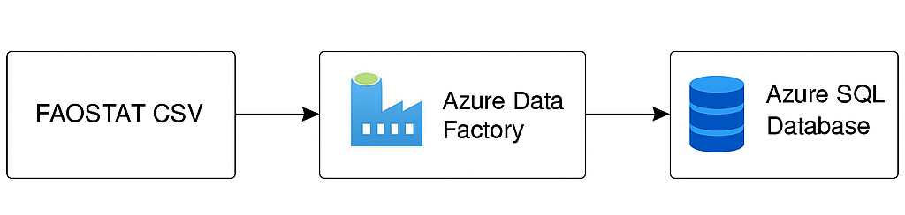

# Azure Data Factory ETL Pipeline for Agricultural Data Integration from FAO

This project demonstrates a complete **ETL pipeline using Azure Data Factory**, built around an **open agricultural dataset (FAOSTAT)**. It extracts crop production data from Azure Blob Storage, transforms and maps it, and loads it into an Azure SQL Database. The project reflects real-world data engineering practices and builds upon my academic work in agricultural sciences and my technical background in IT.

  

## Technologies Used

- **Azure Data Factory**
- **Azure Blob Storage**
- **Azure SQL Database**
- **Azure Resource Groups & ARM Templates**
- **SQL**
- **Power BI for dashboarding** (not included yet)

## ETL Pipeline Overview

1. **Extract**  
   The FAOSTAT CSV file containing crop data (area harvested, production, etc.) is uploaded to Azure Blob Storage.

2. **Transform**  
   Azure Data Factory maps and validates the dataset (handling field length, type conversion, etc.)

3. **Load**  
   Cleaned records are inserted into an Azure SQL table called `CropProduction`.

## Project Structure

    -dataset/
        -faostat_crop_data_sample.csv # Light sample version 
    -arm_templates/
        -ARMTemplateForFactory.json # Main pipeline template
        -ARMTemplateParametersForFactory.json
    -sql/
        -create_crop_table.sql # Initial table schema
        -alter_column.sql # Adjustments for wide text fields
    -screenshots/
        -etl_pipeline_graph.png # Architecture diagram
    -README.md

## Author

👩‍💻 Gina Lopez  
IT Graduate | Agricultural Scientist | Data Engineer

## Objective of the project

Demonstration purposes.